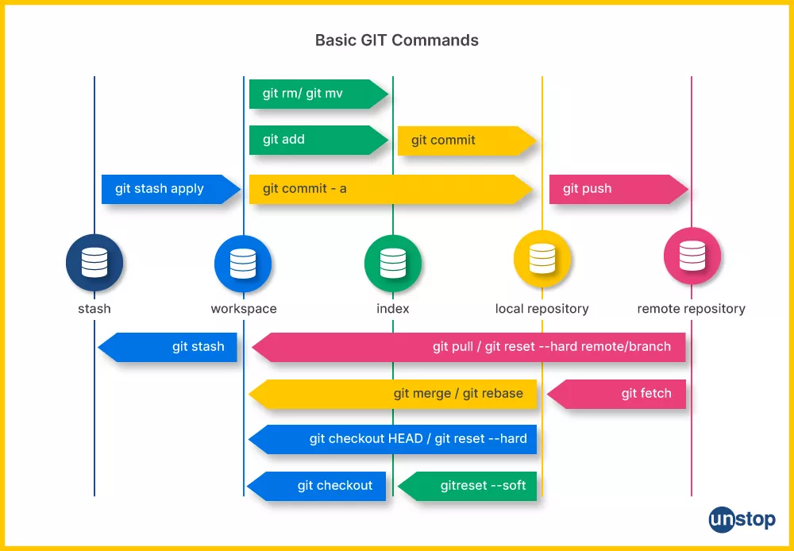

# Git-Commands

## Table of Contents

- [Repository](#git-repository)

- [Basics](#basics)

- [Remote Repository](#remote-repository)

- [Branches](#branches)

- [Git Checkout](#git-checkout)

- [Reversing Changes](#reversing-changes)

  - [Git Clean](#git-clean)

  - [Git Revert](#git-revert)

- [Git Subtree](#git-subtree)

- [Summary](#summary)

## Git Repository

### Git Initialization:

```bash
git init
```

### Delet the Initialized git repository:

This will remove the version control system

```bash
rm -rf .git
```

### Display the status of git repository:

```bash
git status
```

### Display commits history:

```bash
git log
```

## Basics

### Add all files to staging area:

```bash
git add .
```

### Remove all files from staging area:

```bash
git rm --cached -r .
```

### Commiting the staging area files:

```bash
git commit -m "Intial Commit"
```

## Remote Repository

### Pushing Local Repository to Remote:

```bash
git push origin master
```

### Pull from Remote to Local:

```bash
git pull
```

### Cloning a Remote Repository:

```bash
git clone <url>
```

### Merging a Remote Branch with Local:

```bash
git pull origin <branch_name>
```

This command merges the remote branch with the local repository.

## Branches

### Creating a branch:

```bash
git branch <branch-name>
```

### Displaying all the branches:

```bash
git branch
```

### Merging a Branch with the Main Branch:

```bash
git merge <branch-name>
```

## Git Checkout

### Switching Branches:

```bash
git checkout <branch-name>
```

### Create a new branch and switch to it:

```bash
git checkout -b feature/new-feature
```

### Check out a specific commit:

```bash
git checkout <commit-hash>
```

Go to the latest commit of the working branch:

```bash
git checkout <branch-name>
```

This updates your working directory to the latest commit on the specified branch.

## Reversing Changes

### Reset to a specific commit:

```bash
git reset [options] <commit-hash>
```

This resets the state of your repository to the specified commit.

### Reset Soft (keep changes in staging):

```bash
git reset --soft <commit-hash>
```

This undoes the last commit but keeps the changes from that commit in the working directory and staging area.

## Reset Hard (Discard Changes):

```bash
git reset --hard <commit-hash>
```

This permanently moves the branch pointer to the specified commit, resets the staging area, and discards all changes in your working directory.

>Note: After resetting, you may want to update the remote repository:

```bash
git push --force origin <branch-name>
```

## Git Clean

### Check for Untracked Files:

```bash
git clean -n
```

### Remove Untracked Files:

```bash
git clean -f
```

>Use this with caution, as it permanently deletes untracked files.

## Git Revert

### Revert a Specific Commit:

```bash
git revert <commit-hash>
```

This creates a new commit that undoes the changes made by a previous commit.

## Git Subtree

Git subtree allows you to embed one Git repository within another as a subdirectory.

### Add a Subtree:

```bash
git subtree add --prefix=subdir-name remote-repo.git branch-name
```

# Summary


